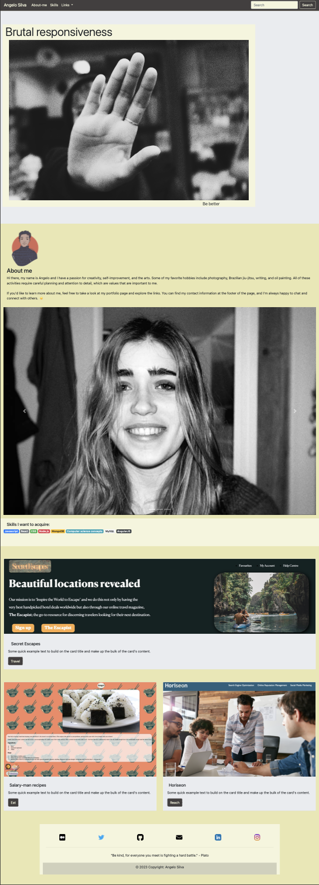

# Bootstrap Project 3
The portfolio project is built using HTML, CSS, and JavaScript, and is styled using the Bootstrap framework.

## Features

- Responsive design for optimal viewing on any device
- Navigation bar with dropdown menu for easy access to different sections of the site
- Hero section with a background image and text
- About/contact section with media object and form for contacting Angelo
- Skills section with a list of Angelo's skills and experience
- Links section with a dropdown menu of links to other projects Angelo has worked on 
- Footer with social media links and a form for subscribing to updates 

## Why should Bootstrap be used?

Bootstrap is a powerful front-end framework that makes it easier to create responsive, mobile-first websites and web applications. 

Knowing how to use Bootstrap can be beneficial because it provides a quick and easy way to develop websites that are optimized for multiple devices. It also offers a wide range of features such as pre-built components, grid system, and more, which can help speed up the development process. 

Additionally, Bootstrap is open source and free to use, making it an ideal choice for developers who want to create websites quickly and efficiently.

##

[Link to deployed website](https://pandersail.github.io/Bootstrap_Project_3/)

### Dependencies 
The site uses the following external dependencies: 
- Bootstrap CSS: https://cdn.jsdelivr.net/npm/bootstrap@4.0.0/dist/css/bootstrap.min.css 
- Font Awesome: https://cdnjs.cloudflare.com/ajax/libs/font-awesome/5.15.1/css/all.min.css 
- jQuery: https://cdnjs.cloudflare.com/ajax/libs/jquery/3.6.0/jquery.min.js 
- Popper.js: https://cdn.jsdelivr.net/npm/@popperjs/core@2.16.1/dist/umd/popper.min.js 
- Bootstrap JS: https://cdn